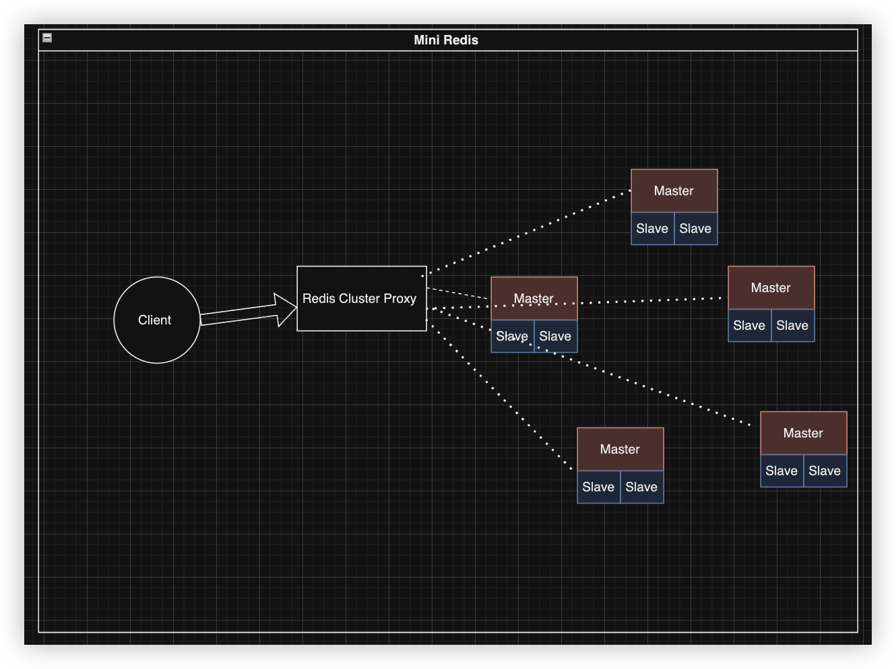

# Mini-Redis

Mini-redis is an idiomatic implementation of a [Redis](https://redis.io) client and server written in Rust. The following picture shows the architecture of the project.


##### Client

The client will parse the command and send it to the server. The client will also parse the response from the server and print it to the console.

##### Redis Cluster Proxy

The proxy send the key to the corresponding server according to the hash value of the key.

##### Server

The server will parse the command and execute it. The server will also parse the response from the server and print it to the console.

### Features

##### Supported commands

- [x] get
- [x] set (with ttl)
- [x] del
- [x] publish
- [x] subscribe

##### AOF (append only file) persistence

After each command, the server will write the command to a file, which can be used to recover the server after crash. The log file is under `./log/` folder.

##### Leader-Follower replication

The server can be started as master or slave using the script, and the slave will return **Error** if you try to write to it. Once you have written to the master, the slave will be updated automatically, and you can `get` the value from the slave.

##### Redis Cluster

Redis Cluster proxy is supported to send the command to other nodes according to the hash value. Like the Leader-Follower replication, the redis cluster is also available to start with the script.

##### Graceful shutdown

Upon receiving the signal, the server will stop accepting new connections, and wait for all the clients to finish their commands. After that, the server will exit.

##### Transactions

`Multi Exec` and `Watch` are supported.

### Testing

- `aof.sh` will test the AOF persistence feature.
- `master_slave.test.sh` will test the Leader-Follower replication feature.
- `proxy_test.sh` will test the Redis Cluster feature.

### How to build

```bash
cargo update
cargo build
```

### How to run

To run the client, server, proxy manually, you can use the following commands:

```bash
cargo run --bin client <server_address> <command> <args>
cargo run --bin server <server_name>
cargo run --bin proxy <proxy_name>
```

### Usage

Run `cargo run --bin client help` to get the command list.

### A demo:

https://drive.google.com/file/d/1fWt8WPO9Jb0G5f9cSlnGq--41fDuBoKy/view?usp=sharing
